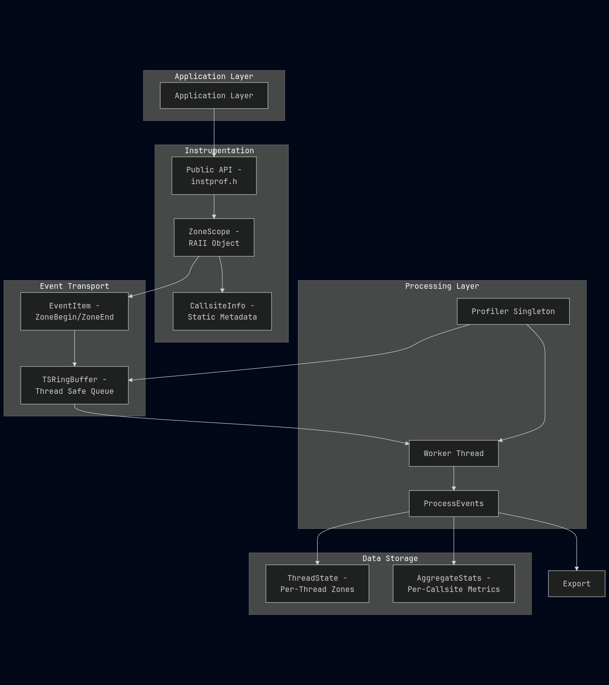

# InstProf


> [!Warning]
> This repository is undergoing active development. Expect possible modifications to code structure, features, or dependencies.


InstProf is a lightweight C++ profiling library that instruments code execution using RAII-based scope tracking. It records timing information for annotated code regions (called "zones") and aggregates statistics. 


Primary Use Cases:

- Performance profiling of multi-threaded applications
- Identifying hot paths and bottlenecks
- Understanding recursive call patterns
- Analyzing time distribution across nested function calls
- Exporting execution traces for visualization in external visualization tools

---

### Key Features

| Feature                      | Description                                                                 |
|------------------------------|-----------------------------------------------------------------------------|
| RAII Instrumentation         | Automatic zone entry/exit tracking                    |
| Zero Runtime Overhead When Disabled | IP_ENABLE=0 compiles to no-ops; profiling code is eliminated                |
| Thread-Safe                  | Thread safe queue supports concurrent instrumentation from multiple threads   |
| Low Overhead                 | Heavy processing happens asynchronously |
| Nested Zone Support          | Tracks call depth and calculates inclusive vs. self time                   |
| Per-Callsite Aggregation     | Accumulates statistics for each instrumentation point |
| Chrome Trace Export          | Generates iptrace.json for external visualization tools supporting Trace Event Format              |

---

### Quick Example

```cpp
#include "instprof.h"

void process_data(int n) {
    IP_FUNC_SCOPE();  // Automatically named "process_data"
    
    for (int i = 0; i < n; ++i) {
        IP_NAMED_SCOPE("iteration");  // Custom name
        // ... work here ...
    }
}

int main() {
    IP_FUNC_SCOPE();
    process_data(100);
    // Profiling data automatically collected and exported on shutdown
}
```

This generates:

- Per-thread timing data for each zone
- Aggregate statistics per callsite (e.g., "iteration" called 100 times)
- Nested timing relationships (main → process_data → iteration)
- JSON trace file for external visualization

---

### Prerequisites

InstProf requires: 

| Requirement   | Minimum Version     |
|---------------|---------------------|
| CMake         | 3.25                |
| C++ Compiler  | C++23 support       |
| Platform      | Linux (primary)     |

Currently, InstProf supports Linux on x86_64 architecture. The build system enforces these requirements through compile-time checks in
src/core/Core.h

---

### Building

```bash
git clone https://github.com/J-Cowser/InstProf
cd InstProf

mkdir build
cd build

cmake ..       # configure the project
cmake --build .   # compile
```

#### Build Options Reference

| CMake Option                  | Type    | Default | Description                          |
|-------------------------------|---------|---------|--------------------------------------|
| IP_ENABLE                     | Boolean | ON      | Enable profiler instrumentation      |
| CMAKE_BUILD_TYPE              | String  | None    | Build configuration (Debug/Release)  |
| CMAKE_EXPORT_COMPILE_COMMANDS | Boolean | ON      | Generate compile_commands.json       |

The IP_ENABLE option defined in CMakeLists.txt controls whether profiling code is compiled into the library. When disabled, instrumentation macros expand to nothing

---

### Integrating Into Your Project

##### CMake Integration

Add InstProf as a subdirectory in your project's CMakeLists.txt:
```cmake
# Add InstProf library
add_subdirectory(path/to/InstProf)

# Link against your executable
target_link_libraries(YourExecutable PRIVATE InstProf)
```
---

### Instrumenting Your Code

To use InstProf, include the single public header in your source files:

```cpp
#include "instprof.h"
```
In this header, InstProf provides two primary macros for instrumenting code:

| Macro                     | Purpose                    | Scope Name                          |
|---------------------------|----------------------------|-------------------------------------|
| IP_FUNC_SCOPE()           | Profile entire function    | Uses `__func__` (function name)     |
| IP_NAMED_SCOPE("name")    | Profile code block         | Uses provided string literal

### Usage Patterns

#### Function-Level Profiling

Add IP_FUNC_SCOPE() at the beginning of any function to profile it. The macro uses the compiler-provided __func__ to automatically name the profiling zone:

```cpp
void my_function() {
    IP_FUNC_SCOPE();
    // Your function body here
}
```

#### Named Scope Instrumentation

Use IP_NAMED_SCOPE(name) to profile specific code blocks with custom names:

```cpp
void my_function() {
    IP_FUNC_SCOPE();

    for (int i = 0; i < 1000; ++i) {
        IP_NAMED_SCOPE("loop_iteration");
        // Work here
    }
}
```

--- 

### Architectural Overview

InstProf follows a producer-consumer architecture where application threads produce profiling events through RAII instrumentation, and a dedicated worker thread consumes and processes these events asynchronously.



### Runtime Behavior


